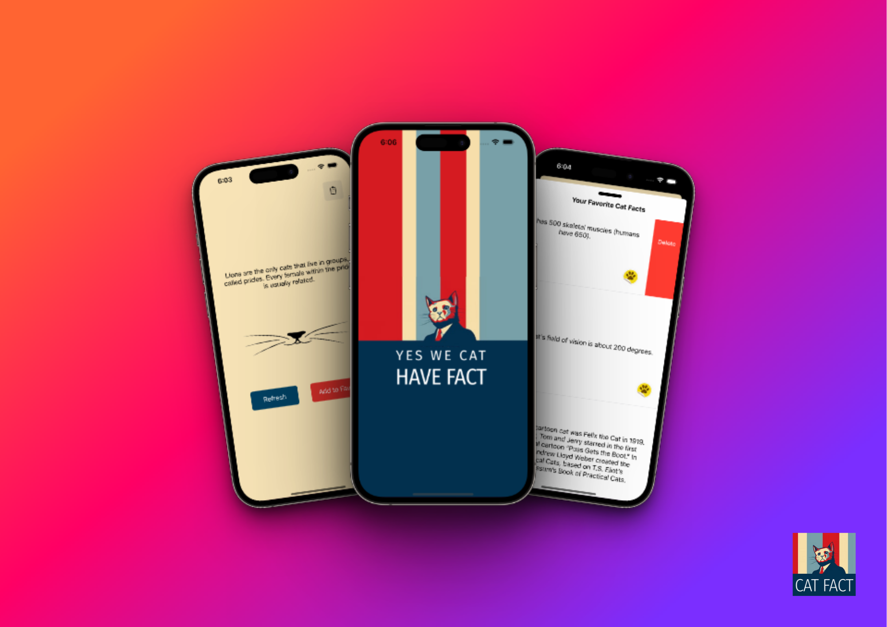
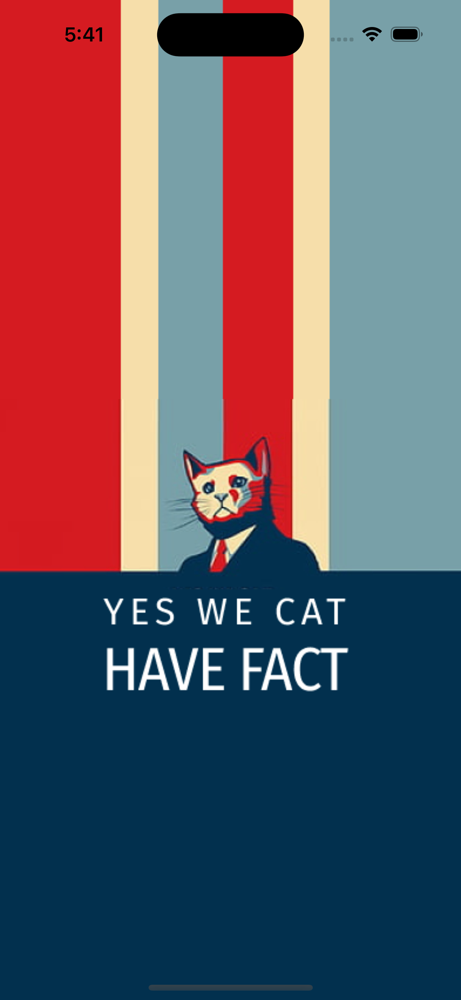
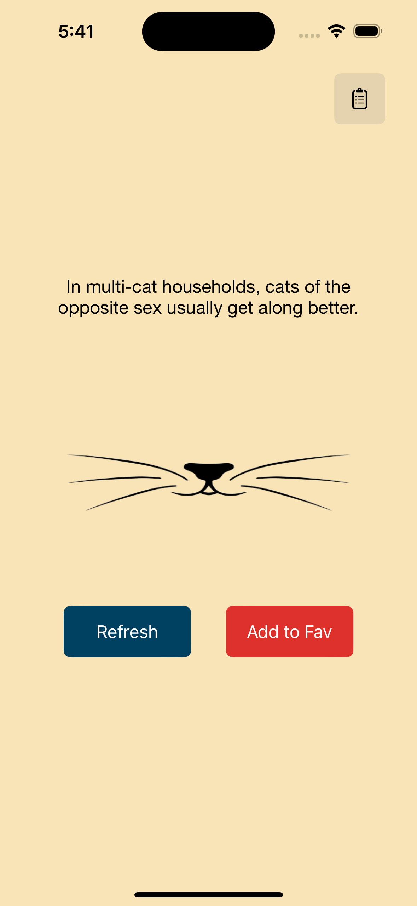

# CatFact

CatFact is a simple fun iOS app that generates random facts about cats with a single button click. This app allows users to explore fascinating cat facts, mark them as favorites, and view their favorite facts in a convenient UITableView. 

## Features

- Random Cat Facts: Generate random cat facts by clicking a button.
- Favorite Facts: Mark interesting facts as favorites for quick access.
- Favorites TableView: View and manage favorite cat facts in a UITableView.
- User-Friendly Interface: Intuitive and easy-to-use interface with smooth navigation.

## Technologies Used

- UIKit
- Storyboard
- Networking: Fetching cat facts from an API.
- UITableView: Displaying and managing favorite facts.
- Persistence: Saving and loading favorite facts locally.

## Screenshots

## How to Use

1. Clone or download the CatFact repository.
2. Open the project in Xcode.
3. Build and run the app on a simulator or device.
4. Click the "Generate Fact" button to fetch a random cat fact.
5. Mark interesting facts as favorites by tapping the heart icon.
6. Access your favorite facts by navigating to the "Favorites" tab.
7. Swipe left on a favorite fact in the UITableView to delete it.

## Contact

[Subrata Samartha](mailto:subratasamartha@gmail.com)

Thank you for your interest in CatFact! I hope you enjoy it.
